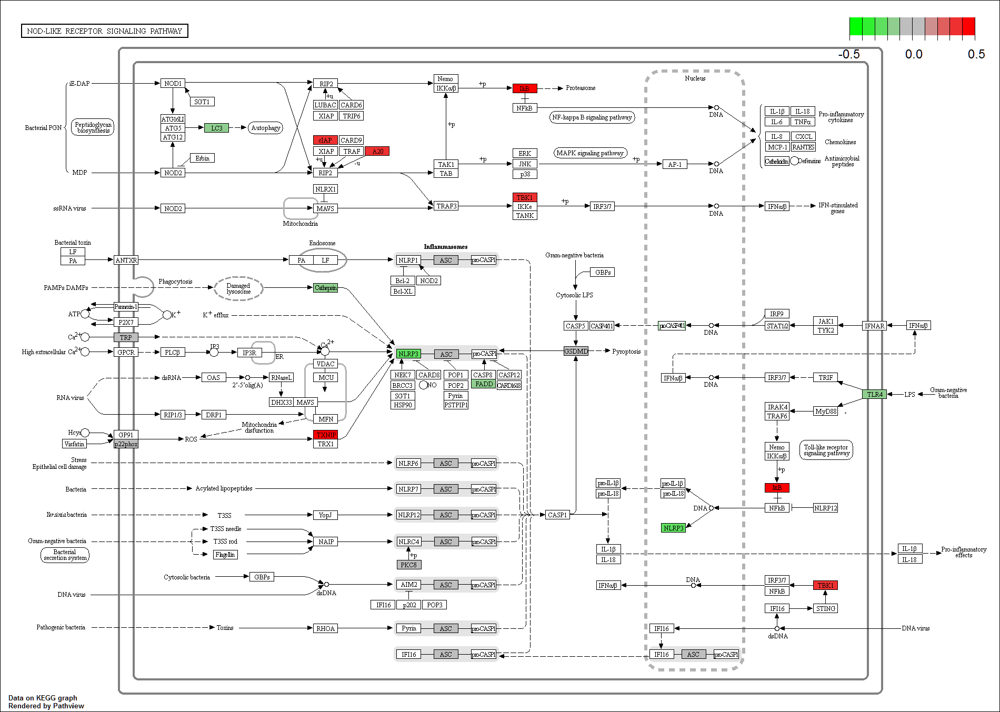
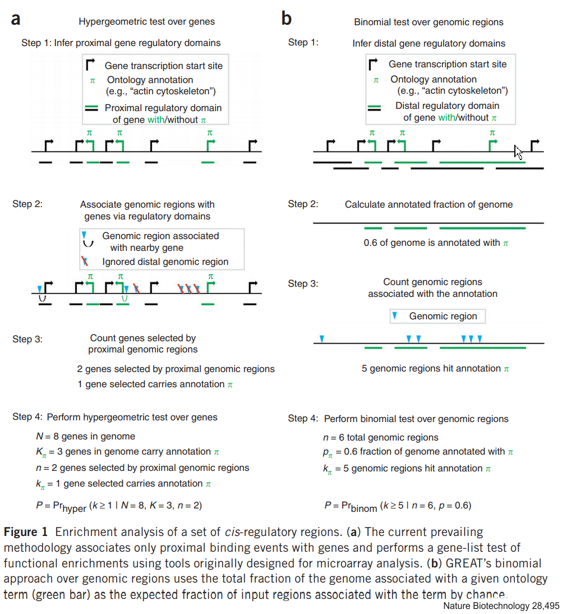
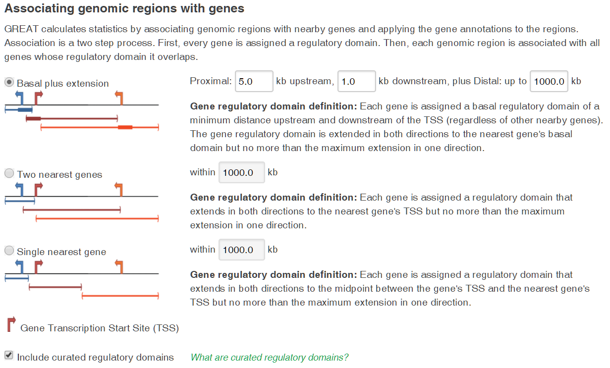

```{r setup, include=FALSE}
knitr::opts_chunk$set(echo = T, out.width=3000, message = F, warning = F, knitr.table.format = "html")
options(width = 400)
```
# Intoduction

This Rmd file is a companion file for the Chipseq part of a Chipseq/Atacseq workshop that we gave in the University of South Carolina in 2017. The ATACseq portion is here (https://github.com/doliv071/ATACseq). Our main assumption is that you have access to bam files that contain your aligned reads and BED files with coordinate of called peaks. Here we will use **narrowpeaks** file produced by MACS2 that besides peaks coordinate contain additional fields with peak name, summit coordinates, peak size, quality, and associated p values 

For this tutorial we will be using a variety of Bioconductor packages that relies heavily on multiple R and Bioconductor data structures (S4 classes, GRanges, IRanges) as well as package-specific data structures. We will have no time to deal with data structures in depths but at appropriate places I will be referencing resources that cover more common data  types in depth. for everything else `str()`, `typeof()` and `class()` are your best friends to visualize the structure of specific classes

As usually with R - there are more than ... five ways of doing things therefore what we will show today can be easily modified and expanded. I don't even claim that this is the best or the  only way of doing the analyses but it is at least on one way to analyze the data.

That being said lets begin.

First lets create a project that will contain all materials related to this workshop.

I prefer to place all BAM and BED files for a given replica into the same directory and the input file elsewhere. This arrangement allows for a better automation of data processing, decrease amount of typing and decrease mistakes. All bamfile also have matching index files. If you don't have index file they could be created later using **Rsamtools**.  I strongly suggest using patterned names - this will allow you to quickly search for data files that belong to the same type. 


```{r, collapse = T}
library("Rsamtools")          
library("GenomicRanges")    
library("ChIPQC") 
library("BiocParallel")
library("ChIPpeakAnno")
library("ChIPseeker") 
library("TxDb.Mmusculus.UCSC.mm10.knownGene")
library("org.Mm.eg.db")
library("GenomicAlignments")
library("RColorBrewer")
library("ggplot2")
library("genomation")
library("GGally")
library("knitr")
library("kableExtra")
library("BSgenome.Mmusculus.UCSC.mm10")

#annotation section
library(clusterProfiler)
library(ReactomePA)
library("pathview")
library(rGREAT)
library(grid)
library(gridExtra)
```
The data sets we use here have been derived from a chipseq experiment in mouse macrophages aimed to determine the distribution of  Glucocorticoid receptor (a DNA binding transcription factor) in macrophages treated with glucocorticoid hormone dexamethasone (D) and untreated control. The experiment has performed in duplicates. Sequenced reads were aligned with Bowtie 2 and the peaks were called with MACS2. The results - BAM file of aligned reads and BED file with called peaks were saver in  `./rep1` and `./rep2` directories. For the sake of saving computational time we limited the output  to mouse chromosome 19

We will started by defining locations for BAM and BED files for each replicas using `list.file` function. All expressions here are enclosed in parenthesis to produce and immediate output. As you can see each of these variables contains a vector of locations and file names for either BAM or BED files for individual replica.

```{r}
(bam_rep1 <-  list.files(path = "./rep1", full.names = TRUE, pattern = "bam$"))

(bam_rep2 <-  list.files(path = "./rep2", full.names = TRUE, pattern = "bam$"))

(bed_GR_rep1 <- list.files(path = "./rep1", full.names = TRUE, pattern = "bed$"))

(bed_GR_rep2 <- list.files(path = "./rep2", full.names = TRUE, pattern = "bed$"))

(input <- file.path("./input/GR_input.bam"))

```
# Quality Control with ChIPQC 

Now as we defined the location of our files we will perform chipseq quality controls (QC)  using *ChIPQC* package.
ChipQC can work either with a single ChipSeq sample or an entire experiment. If you use this package for a large experiment using "real" data sets on a single computer  the entire analysis will take some time so I suggest running it overnight. 
Bam file need to be first sorted and indexed.
Both could be achieved with, for example, `Rsamtools::sortBam()` and `Rsamtools::indexBam()` respectively.

For the sake of demonstration here and thereafter we will first perform a specific operation for a single sample of file and then look at more "automated"" version 

For an individual sample you run a suite of QCs by calling `ChIPQCsample` function. In the example below we provided the following arguments
**bam_rep2[1]** - the path/filename for the bam file

**chromosome** - chromosome name as defined in a bam.BED files ("chr19" in this case)

**peaks** - the path/filename for a matching  BED file with peaks

**blacklist** - the path/filename for a BED file with blacklisted regions

**annotation** - argument define the genome that was used for alignment

`ChIPQCsample` produces an `ChIPQCsample` objects containing input parameters,  quality metrics and a GRange with peak coordinates in read counts in each peak. To extract  GRanges with peak counts use `peaks()`method. To create and HTML report use `ChIPQCreport ()` function

## ...for a single sample
```{r, results='hide'}
single <- ChIPQCsample(bam_rep2[1], chromosomes = "chr19", peaks = bed_GR_rep2[1], blacklist = "mm10-blacklist.bed", annotation = "mm10")

counts_single <- as.data.frame(peaks(single)) #a GRange with peak coordinates, read couns in peaks and peaks summits

ChIPQCreport(object = single, reportName = "ChIPQC_single", reportFolder = "ChIPQC_single")
```

##  ...for an experiment with multiple samples. `ChIPQCexperiment`object

Doing it for a large experiment one by one is impractical. For an entire experiment you need to construct a `ChIPQCexperiment`
object. This is, essentially, a dataframe or a csv file with the following columns:

*SampleID:* Identifier string for a sample

*Tissue:* Identifier string for the tissue type

*Factor:* Identifier string for a factor

*Condition:* Identifier string for a condition

*Treatment:* Identifier string for a treatment

*Replicate:* Replicate number of a sample

*bamReads:* file path to bam file containing aligned reads for a ChIP sample

*bamControl:* file path for bam file containing aligned reads for a control sample

*ControlID:* Identifier string for a control sample

*Peaks:* path for the file with peaks for a sample. The input format is determined by PeakCaller field or caller parameter

*PeakCaller:* Identifier string for peak caller used. If Peaks is not a bed file, this will determine how the Peaks file is parsed. If missing, will use default peak caller specified in caller parameter. Possible values:

 “raw”: text file file; peak scores are in fourth column
 
 “bed”: .bed file; peak scores are in fifth column
 
 “narrow”: default peak.format: narrowPeaks file
 
 “macs”: MACS .xls file
 
 “swembl”: SWEMBL .peaks file
 
 “bayes”: bayesPeak file
 
 “fp4”: FindPeaks v4

*PeakFormat:* string indicating format for peak files; see PeakCaller and dba.peakset

*ScoreCol:* column in peak files that contains peak scores

*LowerBetter:* logical indicating that lower scores signify better peaks

We created one for you and it is located in `chips_seq_summary.csv`. We will load it using `read.csv()` 

```{r, collapse = T,echo = c(1,2)}
chip <- read.csv(file = "chips_seq_summary.csv",stringsAsFactors = F)

chip %>%
  knitr::kable("html") %>%
  kable_styling(bootstrap_options = c("striped", "hover"),font_size = 9)
```

and calculate QC metrics for our entire experiment (2 replicas, two bam files in each replica)

Running this example will take ~ 3 minutes. For a large experiment you can run it over a lunch break or overnight
```{r, results='hide', collapse =T, echo = c(2:4)}
register(SerialParam()) # commented it out when parallel setup  is available
experiment <- ChIPQC(experiment=chip, 
                     annotation="mm10", 
                     chromosomes="chr19", #comment this out if you want all chromosomes to be used. LONG! 
                     blacklist = "mm10-blacklist.bed", 
                     profileWin=400, 
                     fragmentLength=125)
```
## `QCmetrics()` and `ChIPQCreport`
You can extract a table with all quality matrices using `ChIPQC::QCmetrics()` accessor and create an HTML report with `ChIPQC::ChIPQCreport`. `peaks()`, similarly to a single sample,  accesses to count matrices for all BED files but produced a `GRangesList` as an output, that can be converted into a list of dataframe with `lapply`

```{r}
(metrics <- kable(QCmetrics(experiment)))

ChIPQCreport(object = experiment, 
             colourBy="Treatment",
             facetBy="Factor",
             lineBy="Replicate", 
             reportName = "ChIPQC_experiment", 
             reportFolder = "ChIPQC_experiment")

counts_all <-  lapply(peaks(experiment), as.data.frame)

```
## Import of BED files. GRanges

Sometimes you don't want or don't need to perform quality control (for example, it has been done already) but you need to convert a preexisting BED file to GRanges.

BED Files and essentially tab-separated tables.  **GRanges**  is an S4 class that was introduced by **GenomicRanges** package to store coordinates of genomic features and their associated annotations. GRanges is very feature-rich class an we can spend probably a separate workshop discussing just that class and its uses. For a comprehensive treatment of GRanges see the vignette for **GenomicRanges** package at http://bioconductor.org/packages/release/bioc/vignettes/GenomicRanges/inst/doc/GenomicRangesIntroduction.pdf

Couple of terms that I will use throughout the talk: object is a collection of variables with a set of functions that can be used be used to performs various actions with these variables. In S4 objects the variables are called "slots" and the functions are called "methods". You use @ or `slot()` to access slots directly, however for a well-written S4 object (in ideal world) you do not have to. Instead you use methods, referred to as **accessors**. To get help for a specific class use `class?` with a class name; for example `class?ChIPQCsample` or  `class?GRanges` will open a page describing  `ChIPQCsample` or `GRanges` classes.

Most of the packages that work with genomic ranges offer functions that convert BED file into GRanges. Most of these functions relies on 
**`GenomicRanges::makeGRangesFromDataFrame()`** or **`GenomicRanges::GRanges()`** function. 
Not to be outdone both ChIPseeker and ChIPSeqAnno offer their own implementations
`ChIPseeker::readPeakFile` and `ChIPpeakAnno::toGRanges`. `toGranges` is more robust, it produces different annotations depending on input format, it also knows how to work with genomes and transcriptomes to extract various Genomic features. `help(toGRanges)` for details.

```{r}
#for a single BED file
(single_BED <- readPeakFile(peakfile = "./rep2/02_GR_D_chr19_rep2.bed"))
```

Importing BED files one by one is  impractical and error-prone when you have many files. We will use file lists that we created at the beginning of this tutorial  and `sapply` function to cycle through all bedfiles for each replica to produce a named lists of Gene ranges. You can access individual elements either by index or by name

```{r, collapse = T}
GR_peaks_rep1 <- sapply(bed_GR_rep1,readPeakFile)
GR_peaks_rep2 <- sapply(bed_GR_rep2,readPeakFile)

names(GR_peaks_rep2)

#These name a somewhat ugly. Because, they are all follow the same pattern we can easily fix that
names(GR_peaks_rep1) <- gsub("/","_",substr(names(GR_peaks_rep1),start = 3,stop = 14))
names(GR_peaks_rep2) <- gsub("/","_",substr(names(GR_peaks_rep2),start = 3,stop = 14))

str(GR_peaks_rep2[[2]], max.level = 2)
```

## Assessing basic peak information. `mcols()`,`length()`,`width()`

Very briefly `GR_peaks_rep2[[2]]` is a `GRange` object (S4)  with 6 slots. `@elementMatadata` slot contains a dataframe with an arbitrary information about indivifula genomic ranges. You can access it using `mcols()`. Before we proceed further I would like to prettify  this output by replacing the default column names by a more informative once.

```{r, collapse = T, fig.height= 4,fig.width = 5}
mcols(GR_peaks_rep2[[2]])

new_names=c("id","summit","size","score","qval")

for(i in 1:length(GR_peaks_rep1)){colnames(mcols(GR_peaks_rep1[[i]])) <- new_names
                                  colnames(mcols(GR_peaks_rep2[[i]])) <- new_names                                                                  }

names(mcols(GR_peaks_rep2[[2]])) # just to make sure we actually changed the names
```

Lets look at basic peak characteristics in our dataset(s)

```{r, collapse = T}
#how many peaks are there?
length(GR_peaks_rep2[[2]])

lapply(GR_peaks_rep2,length)

#What are the width of these peaks
width(GR_peaks_rep2[[2]]) # width() is an IRange and GRange method that retrieves the size of the interval

#Summarize the width of the peaks by replicas
lapply(GR_peaks_rep1,function(x)summary(width(x)))
lapply(GR_peaks_rep2,function(x)summary(width(x)))
```
```{r, fig.height= 5,fig.width =8}
#what is the disribution of  peaks width
hist(width(GR_peaks_rep2[[2]]),breaks = 25)

#plot(density(width(GR_peaks_rep2[[2]])))

#Now lets do the same for all Gene Ranges in  
invisible(par(mfrow=c(2,length(GR_peaks_rep2)))) 

#we use par(mfrow c()) to determine the number of rows and columns in a graphic output
#as I don't care to remember how many datasets I have in GR_peaks_rep2 list I calculate this number using function length() dynamically
#invisible() supresses output of any calculations to the console 
invisible(lapply(GR_peaks_rep1,function(x)hist(width(x),breaks = 30)))
invisible(lapply(GR_peaks_rep2,function(x)hist(width(x),breaks = 30)))

par(mfrow=c(1,1))

#Exersise!  Create a density plot of peaks width for all peaks from the second replica!
```
# Peak Annotation with **ChIPSeeker**

Now, we would like to know the location of our peaks relative to genomic features, such as promoters, exons, intrones and so on.
Both ChIPSeeker and ChIPpeakAnno will do it for you. ChIPpeakAnno requires some preprocessing, so for annotation purposes I will use 
`ChIPSeeker::annotatePeak` function. I again will show its use  on a single dataset and then extend it for the entire experiment. For a complete list of arguments see `help(annotatePeak, package = "ChIPseeker")`
```{r, message = F}
txdb <- TxDb.Mmusculus.UCSC.mm10.knownGene

(ann_single <- annotatePeak(
   peak = GR_peaks_rep2[[2]],
   tssRegion = c(-2000, 500),
   genomicAnnotationPriority = c("Promoter", "5UTR", "3UTR", "Exon", "Intron","Downstream", "Intergenic"),
   TxDb = txdb, 
   annoDb = "org.Mm.eg.db"))                                
```

**genomicAnnotationPriority** - assuming exclusive annotation categories define the order of assignment of a feature to a specific category

**TxDb** - This argument take a TxDb object that contains information about specific annotation track created by `GenomicsFeatures`. For an extensive treatment of Bioconductor annotation infrastructure see http://bioconductor.org/help/workflows/annotation/Annotation_Resources/
TxDb family of packages contain information about gene and transcript models. You can find the entire list (31 currently) here https://www.bioconductor.org/packages/release/BiocViews.html#___TxDb

**annoDb** family of packages (https://www.bioconductor.org/packages/release/BiocViews.html#___OrgDb) contains information collated at a gene level, including all possible gene identifier, GO, KEGG, OMIMs, PMID of papers mentioning genes and so on.

## `csAnno` class

`annotatePeak` produces an S4 object of `csAnno`class - see `help("csAnno-class")`
```{r}
str(ann_single, max.level = 4)
```
A dataframe with feature-level frequencies is `@annoStat` slot. The most important information for us is located in the `@anno` slot. This slot contains an extended GRange object that now contains additional information regarding individual peaks. You can access it as any other slots in S4 objects with **@**. You can also convert it into a data frame that you can save in some human readable format.

```{r}
ann_single@annoStat

#ann_single@anno you can try it but the output is ugly

a <- as.data.frame(ann_single@anno)
```

## `plotAnnoPie()`, `plotAnnoBar()`, `upsetplot()`

Now, you can visualize this information in a variety of ways using `ChIPSeeker::plotAnnoPie`, `ChIPSeeker::plotAnnoBar`
Both these function rely on baseR and therefore, can take a bunch of additional graphic parameters - see `help(par)`.

```{r,fig.height= 2,fig.width = 6}
plotAnnoPie(ann_single)
```
```{r,fig.height= 2,fig.width = 6}
plotAnnoBar(ann_single)
```
Because these annotation categories are exclusive the annotation will be performed based on the priority shown in the legend. To work around this `ChIPseeker` offer `ChIPSeeker::upsetplot` function. `ChIPSeeker::upsetplot` is a wrapper from the original `UpSetR::upset` function and therefore takes all arguments of an original function. Only the first argument (a **csAnno** object) is required, the rest is prettifying output.
```{r,fig.height= 6,fig.width = 7}
ups <- upsetplot(ann_single,sets.bar.color = c("#d95f0e", "#fee0d2", "#98D277","#6F9E4C", "#fc9272", "#9ecae1", "#ffeda0"),text.scale = 2, point.size = 5)
```

Now, we will extend  this analysis to multiple data sets. So, our `bed_GR_rep1` and `bed_GR_rep2` contain the locations of BED files for the first and second replica. We will combine `sapply` and `ChIPSeeker::readPeakFile` to create lists of GRanges for each replica and then use

```{r, results = 'hide'}
GR_peaks_rep1_anno<-sapply(GR_peaks_rep1,annotatePeak,tssRegion=c(-2000, 500), TxDb=txdb, annoDb="org.Mm.eg.db")
GR_peaks_rep2_anno<-sapply(GR_peaks_rep2,annotatePeak,tssRegion=c(-2000, 500), TxDb=txdb, annoDb="org.Mm.eg.db")
```

Use `str()` to tease out the structure of this object.
```{r}
str(GR_peaks_rep1_anno, max.level = 3) 

```
You can use `plotAnnoBar()` to plot multiple annotation objects on the same scale

```{r, fig.height = 2}
#calling plotAnno functions on the list of csAnno objects will produce combined plots
plotAnnoBar(GR_peaks_rep1_anno)
```
```{r, fig.height = 3}
#or you can combine multiple csAnno objects to plot them at the same time
plotAnnoBar(c(GR_peaks_rep1_anno,GR_peaks_rep2_anno), title = "Some peaks")
```

## Comparing replicates, **ChIPpeakAnno**, `findOverlapsOfPeaks()`

At the next step we will compare peak sets between two replicates. The aim of this exercise is to see how well the replicated match. The approach I will be showing could be further extended to look at overlaps between peak sets from various conditions, overlaps between peaks and other genomic features, or even between peaks of different transcription factors. In a literature it is typically referred to as **operation on genomic intervals** (for details see http://bioconductor.org/packages/release/bioc/vignettes/GenomicRanges/inst/doc/GenomicRangesIntroduction.pdf). The generic function for finding overlaps between gene ranges is provided by **Genomics Ranges** package and you are welcome to look them up as just to see what building blocks were used to create much more robust overlapping functions `ChIPpeakAnno::findOverlapsOfPeaks`

```{r}
# So, we all remember that GRanges for our replicas are stored in GR_peaks_rep1 and GR_peaks_rep2 lists and that the second element of each
# list contains peaks from treated cells 

rep_ol <- findOverlapsOfPeaks(GR_peaks_rep1[[2]], GR_peaks_rep2[[2]], 
                              maxgap=1,
                              minoverlap = 1L, 
                              ignore.strand = TRUE)

str(rep_ol, max.level = 2)

#correcting duplicated column names
colnames(rep_ol$overlappingPeaks[[1]])[13:22] <- paste0(colnames(rep_ol$overlappingPeaks[[1]])[13:22],"_2")
```
The output is a list with 7 elements

**`$venn_cnt`**           - an object of VennCounts, used to plot Venn diagrams - more about later
**`$peaklist`**           - a list consists of all overlapping peaks or unique peaks

   ..$ GR_peaks_rep2..2..                     :Formal class 'GRanges' - peaks unique for set 2
 
   ..$ GR_peaks_rep1..2..                     :Formal class 'GRanges' - peaks unique for set 1
  
   ..$ GR_peaks_rep1..2..///GR_peaks_rep2..2..:Formal class 'GRanges' - overlapping peaks

**`$uniquePeaks`**        - an object of GRanges consists of all unique peaks 

**`$mergedPeaks`**        - an object of GRanges consists of all merged overlapping peaks

**`$peaksInMergedPeaks`** - an object of GRanges consists of all peaks in each samples involved in the overlapping peaks

**`$overlappingPeaks`**	  - a list of data frame consists of the annotation of all the overlapped peaks and the distance between them

     **A bug here? when constructing this dataframe  column names were duplicated that might affect your downstream analysis!!!** 

**`all.peaks`**           - a list of GRanges object which contain the input peaks with formatted row names.

## Makig Venn Diagram with ChIPpeakAnno::makeVennDiagram

Now, we can visualize these results by plotting a Venn diagram using `ChIPpeakAnno::makeVennDiagram`. This is an argument -heavy function that can either take the output of `findOverlapsOfPeaks` function directly or you can feed it a list of GRanges corresponding to peaks that you want to overlap. In this case it will call `findOverlapsOfPeaks`, determine the overlap and also test whether the overlap is significant by either hypergeometrics test or permutation test. See `help(makeVennDiagram)` for a description of all arguments. The output is a very publishable Venn diagram

```{r, out.width="300px"}
par(mfrow=c(1,1))
venn <- makeVennDiagram(rep_ol,totalTest=1000, scaled=T, NameOfPeaks=c("GR_Dex_rep1", "GR_Dex_rep2"), fill=c("blue","cyan"),cex=1.5, cat.cex=1,fontface="bold", cat.fontface="bold",main="GR_Dex, rep1 versus rep2")
```

Based on this we have a very good overlap in peak locations. This, however does not tell us much about peak sizes. So, what we can do here is take a union of peaks from both replicas, count the number of reads in each of those peaks and look at correlation in read numbers that fell into each interval.

All set operations that existed in baseR have been updated to be able to work with interval data. You can use the same functions. So, to a GRange with the union of peaks we will use `union()` function
```{r}
peak_u <- union(GR_peaks_rep1[[2]], GR_peaks_rep2[[2]])
```

#Counting reads in peaks, GenomicAlignments::summarizeOverlaps 

Now, we will count our reads that hit these peaks using our bam files. There are several (many) ways of doing this. I will only mention two `Rsamtools::countBAM()` and `GenomicAlignments::summarizeOverlaps` function. `summarizeOverlaps` is the method  for `GAlignments` . 


We will use **GGally** package to plot the summary of pairwise correlation analysis of read counts in peaks in all 4 data sets
```{r}
   
   (count <- GenomicAlignments::summarizeOverlaps (peak_u, c(bam_rep1,bam_rep2), mode=Union,inter.feature=F)) #counting reads in peak_u for all bam files
   #output is a class 'RangedSummarizedExperiment'
   
   count_tab <- as.data.frame(assay(count)) # assay() is an accessor for class 'RangedSummarizedExperiment' that gets you the count table
   
   head(count_tab) 
```   
   
as created this table does not reference peak names. If you want names to be added you can create them from  `peak_u` as following
`count_tab$peakID <- paste0(peak_u@seqnames,":",peak_u@ranges@start,"-",(peak_u@ranges@start+peak_u@ranges@width-1))`

you would also have to adjust `ggpairs` `count_tab` accordingly to exclude peakID column from calculations - `count_tab[,1:(ncol(count_tab)-1)]`
```{r}   
   (plot_tab <- GGally::ggpairs(count_tab,
                       upper = list(continuous = wrap('cor', 
                       method = "spearman", 
                       size = 7, 
                       color="black"))) )

```

# Constructing read distrubition heatmaps with **genomation**

Now, lets construct read density heatmap and average read density distributions using `genomation` package. Both ChipPeakAnnot and Chipseeker have similar function but `genomation`implementation is more straightforward and requires minimal data transformation before the analysis 

First we create a list of scorematricies (coverage matrices) for all bam files in both replicates (defined in **target** argument below).
The function needs to know where to count reads, in our case we want to use `peak_u` GRange that contains the union of peaks for the hormone treated macrophages to count reads in both replicas (**window=peak_u**). **type=** specifies the type of target file - bam or bigWig.
**bin.num** is needed only when the widths of you peaks are not equal. In this case all peaks are split into **bin.num** bins and the coverage is calculated per bin rather than per base. Finally, setting **rpm** to **TRUE** will perform library size normalization.

```{r, collapse=T}
#sorting peaks in a peak_u GRange based on read counts in one of the replicates - need to do it to produce heatmap plot later

peak_u <- peak_u[order(count_tab$`02_GR_D_chr19_rep2.bam`, decreasing = T)]

mat <- ScoreMatrixList(targets = c(bam_rep1,bam_rep2),#vector with the names/path to our bam files
                       windows = peak_u ,             # GRange with intervals
                       type="bam",                    # Type of the files in targets (bam and bigWig are supported)
                       bin.num=300,                   # If peaks are not of equal length, use by binning
                       strand.aware = F,              #
                       rpm = F                        # Normalize to the library size
                      )

names(mat) # too long. replace them by shorter names

names(mat) <- c("GR_Un1","GR_Dex1","GR_Un2","GR_Dex2")
```

`multiHeatMatrix` plots multiple heatmaps from a `ScoreMatrixList` object created above. This function takes many arguments (see the help page) of which I am only using a few. **col=** changes the color of the heatmap from its default matlab scheme. **common.scale = T** will draw the color intensities on the same scale. The scale will be determined by minimum of **all** matrices and maximum of **all** matrices. **winsorize =** "determines the upper and lower percentile values to limit the extreme values. For example, c(0,99) will limit the values to only 99th percentile for a matrix, everything above the 99 percentile will be equalized to the value of 99th percentile.This is useful for visualization of matrices that have outliers.(help page)"

```{r}
mat_multy <- multiHeatMatrix(mat,
                             #order = T,
                             col=brewer.pal(9, 'BuPu'), 
                             common.scale = T,     #rescale colors to the common scale
                             winsorize = c(0, 99)) #remove exteme values corresponding to percentiles 

```

Finally, we will build a profile for read distribution within our "peaks". We will use `genomation::plotMeta`.

```{r}
par(mar=c(5.1,4.1,4.1,2.1)) #multiHeatMatrix does not return graph parameters to default values. When you write your own function, please restore defaults with on.exit()
DD<- plotMeta(mat, 
         profile.names=names(mat), #this  is where the names for curves will be taken
         main="Title of this figure",
         #xcoords=c(-200, 200),    #changing X axis labels to this values
         winsorize=c(0,99),
         centralTend="mean",       #per position central tendency will be calculated with
         #meta.rescale =T,         #scales all distributions to [0,1].comment out dispersion argument if you set meta.rescale=T
         #smoothfun=function(x) stats::smooth.spline(x, spar=0.5), # smoothes distributions 
         dispersion="se",          # alternatively "sd" or "IRQ"
         lwd=3,
         xlab = c("Bins"),
         las=1,
         cex=2
         )
abline(v=150,lty=2)

par(mar=c(5.1,4.1,4.1,2.1))
```

#Extracting peak sequences. **BSgenome** packages 

We have coordinates of our peaks now we would like to get actual sequences of our peaks. This is useful, for example if you would like to perform site overrepresentation analysis. To do this you will need one of the packages from `BS.` family that stores actual genomic sequences and methods of working with them. Since our data originated from mice and were aligned against mm10 version of genome we will use  `BSgenome.Mmusculus.UCSC.mm10`. This package also provides `getSeq()` methods for sequence extraction. Before we use `getSeq` we will trim all peaks to the same size relative to the peak midpoint using a small function below.
```{r}
trimToSize <- function(x){
   #x - object of class GRanges
   half <- width(x)/2                        #vector of range midpoint 
   center <- ceiling(start(x) + half -1)     #vector of range centers
   trimsize <- ceiling(mean(half, trim=0.1)) #a trimmed mean of halfsizes
   start(x) <- center - trimsize             #calculate new start coordintes
   end(x) <-  center + trimsize              #calculate new end coordinates
   x}                                        #return a GRange with new start/end coordinates

peak_u <- trimToSize(peak_u)

mm10 <- BSgenome.Mmusculus.UCSC.mm10 #

peak_seq <- getSeq(mm10,peak_u)

head(peak_seq,3)

```
`getSeq` returns an object of class `DNAStringSet` (Biostrings package).If we want to export this object as a fasta file  we need to provide names for individual sequences. We will use the same approach as before - concatenate the chromosome name and start/end coordinates into a sequence names. Names of elements in most R objects are accessed using `names()` and are replaced using `names() <-`. Here I am using  **peak_u**  to create our name using `paste0()`.  

```{r}
names(peak_seq) <- paste0(as.vector(peak_u@seqnames),":",start(peak_u),"-",end(peak_u))

head(names(peak_seq),3)
```

To save this as a fasta file we will use `Biostrings::writeXStringSet` function. This function support either fasta or fastq output
Now, you can use this fasta file for motif prediction/overrepresentation analysis.

```{r}
writeXStringSet(x = peak_seq, filepath="gr_d_union.fasta", append=FALSE,
                compress=FALSE, compression_level=NA, format="fasta")

```
This fasta file can be used as an input for motif-predicting software such as MEME-chip (http://meme-suite.org/tools/meme-chip). Here is an example of a main page with the results of the de novo motif prediction with our peak set. You can access all results of this analysis at  `./appMEMECHIP_4.12.01509807486762-571624097/meme-chip.html` 

<embed src="./appMEMECHIP_4.12.01509807486762-571624097/meme-chip.html" width="900" height="900" type='application/html'>

#Functional Peak annotation

Functional annotation of Chip/Atacseq outputs attempts to link peaks (binding or DNA accessibility events) to genes that might be regulated by those events. Genes, or rather, TSS proximity still remains a common metric. Several approaches were developed to improve this metric but generated prediction must to be treated with caution. Pure proximity approach ignores long-range interactions; weighting by RNAseq/microarray data focuses on transcription response at a given time and therefore ignores temporal dynamics and still does not help us with long-range interactions; using TADs(trans-activating domains) is essentially a proximity analysis by other name and does not provide gene-level resolution. Analysis of peak/gene association will require full dataset, fortunately we will not need bam file for this

This is is two-step process: linking peaks to genes and then using these genes as a source list for downstream set enrichment or pathway analysis.

The fists step is, essentially,  defined by your existing genome annotation. However, beyond associating peaks with genes you can do a number of other things, as long as you know what IS IN your existing genome annotation. For example, you can look at associations between your peaks and disease-relevant SNPs or CNVs; or, after you run motif prediction, you can look at associations between your predicted sites and disease-related SNPs;  your peaks and evolutionary conserved regions, or the opposite most divergent regions in your species; your peaks and other experimentally determined binding sites from ENCODE or other repositories (try ORegAnno); your peaks and PatScan entries (patented sequences database)? There is really no limit here

We will start by using tools that are provided by the **ChIPseeker**. The advantage here is that Guangchuang Yu who authored this package also created  several packages that deal with Gene set enrichment analysis and GSEA, including **DOSE**, **clusterProfiler** and **ReactomePA** which provides a certain levels of integration and continuity. 

As an input we will use all peaks from Dex-treated macrophages, not just chromosome 19. The workflow, however is similar

## Loading and processing a full dataset of Glucocorticoid receptor peaks in a hormone-treated macrophages.
```{r, collapse=T, fig.height= 2,fig.width = 7}
gr_full <- readPeakFile(peakfile = "./full_data/02_GR_D_rep2.bed") # reading a dataset

gr_full_anno <- annotatePeak(gr_full, tssRegion=c(-2000, 500), TxDb=txdb, annoDb="org.Mm.eg.db") # annotate the peaks

plotAnnoPie(gr_full_anno) # plot a pie chart just so we have it

str(gr_full_anno, max.level = 3) # structure of a csAnno object, all data we are interested is in @anno slot

gr_table <- as.data.frame(mcols(gr_full_anno@anno)) #we can extract annotation as a dataframe using mcols()

View(gr_table)
```
## Extracting per-peak annotation.

Because I referred specifically to mouse annotation database package - `annoDb="org.Mm.eg.db"` we now have additional columns with gene IDs, If you omit it the only annotation provided will be **geneID** column that contains ENTREZ IDs. Besides this column we now have **transcriptID** with transcript IDs from UCSC browser, ENSEMBL IDs, gene symbols and gene descriptions. 

Distance to TSSs could be used for further data sectioning, and peaks scores or log-transformed p-values could be used for peak ranking 

```{r, fig.height=4,fig.width = 6 }
hist(gr_table$distanceToTSS, xlim=c(-200000,200000),breaks = 1000) #quick and dirty plot of peak distribution relative to the TSS 

```

# Functional annotation of peak-associated genes with **clusterProfiler** 

There are multiple R packages that perform gene set enrichment analysis. I will use two of them today:  **clusterProfiler**  and **rGREAT**. The first is a full-feature package with a number of visualization tools. The second one is an R web access interfaces for GREAT at http://great.stanford.edu/public/html/

**clusterProfiler** is another tool authored by Guangchuang Yu at School of Public Health, The University of Hong Kong. The package provides a collection of functions for GO enrichment analysis, KEGG pathways analysis, disease association analysis vie **DOSE** - another of his packages, Reactome pathways analysis (**ReactomePA** by the same author). It also provides an interface to DAVID (https://david.ncifcrf.gov/), a set of tools for MSigDB analysis (has to be installed locally - http://software.broadinstitute.org/gsea/msigdb) and a set of function for any list enrichment analysis. In addition, the package provides an impressive set of visualization tools. Finally, if ranked list of genes is available **clusterProfiler** provides few tools for GSEA analysis

##Input file formats: 

**clusterProfiler** enrichment analysis - vector of **ENTREZ gene IDs** (or other IDs supported by org.db)

**clusterProfiler** GSEA - ranked list of genes as a named vector with names as ENTREZ IDs

**rGREAT** - a GRange


## Mapping gene IDs back and forth with `select()`

Before we proceed, below is a general approach for converting various gene identifiers available via org.db packages.

Where to get ENTRES IDs? If you used `annotatePeak` for your annotation you will find it in  `$geneid` column of  `@anno` slot of your `csAnno` object or in the annotation table we have created earlier. Now, if you used something else you can convert your IDs into ENTREZ IDs using an appropriate `org.db` package for your species as following:

``` {r,}
genelist <- c("Ncoa2","Actb","Ncoa1") #a toy gene list with HUGO gene symbols

genelist1  <- select(org.Mm.eg.db, keys=genelist, columns=c('ENTREZID'), keytype='SYMBOL')

genelist1
```
here `select` is a methods that allows you to extract data from annotations
**keys =** contains vector of items whose IDs you want to convert (in this case a vector of gene SYMBOLs)
**keytype ** tells R what kind of input your provide - in this case gene **SYMBOL**
**columns ** tells R what you are looking for (in this case **ENTREZID**)

you can check what kind of **keytypes** and **columns** your annotation object has by calling `ketype` or `columns` functions with your object name -  `keytypes(org.Mm.eg.db)`

Now, when we know how to map gene IDs back and forth we are ready to use **ClusterProfiler**

##GO Enrichment

`enrichGO` function calculates the enrichment of annotated genes in GO categories and produces an object of 'enrichResult' class. The table with enriched GO categories is in `@result` slot. If the search is to slow on your system, uncomment the `load` command to load a precomputed result of this analysis

```{r}
gr_go <- enrichGO(gene          = unique(gr_table$geneId), #your list of genes
                #universe      = names(geneList), #background list of genes 
                keytype =  "ENTREZID", #type of your gene names
                OrgDb         = org.Mm.eg.db,
                ont           = "ALL", #or "MF","BP","CC"
                pAdjustMethod = "BH",
                pvalueCutoff  = 0.0001,
                qvalueCutoff  = 0.001,
                readable      = TRUE)
#load(file="gr_go.rda")

str(gr_go,max.level=2)#  Table with the results is in @result slots
```
## Output visualization with `dotplot()` and `barplot()`
The results of GO analysis can be visualized in a variety of ways. The package provides two functions `dotplot` and `barplot` that show top GO categories sorted by the ratio of genes in your annotation to a total number of genes
```{r, fig.height=5,fig.width=10}
dotplot(gr_go,           #enrichResult object
        showCategory=20, #top categories sorted by adjusted pValue
        x= "count",      #or "gene ratio"
        font.size=14)

barplot(gr_go, showCategory=20)
```
## Writing your own function for data visualization

This output I find somewhat unsatisfactory as far as data visualization goes. If I want to show this data graphically I prefer to actually show p values explicitly rather than use colors. Below is my version of the barplot  function(`bar2`). It takes two arguments: the name of your `enrichResult` object and the number of the top categories to plot (10 by default)  

```{r,fig.height=4,fig.width=10}
bar2 <- function( gene_tab,N=10){
# Plots top N(default = 10) most enriched terms(sets) sorted by FDR q value, from a dataframe produced by EnrichGO
#  ARG@ gene_tab - enrichResult object
#  ARG@ N - number of categories to plot 
  gene_tab  <- gene_tab@result
  gene_tab$Description <- factor(gene_tab$Description, levels = gene_tab$Description[order(gene_tab$qvalue, decreasing = T  )])# supresses reordering of factors in alphabetical order
  
  t <- gene_tab[1:N,]  #temporary table of top N categories
  
  t$set_size <-  sub("\\/[0-9]*", "", t$BgRatio) #extract set sizes from the BgRatio column
  
  top_10 <- ggplot(data=t,mapping=aes(x=Description,y=-log10(t$qvalue) ) )+
  geom_bar(stat="identity", fill="steelblue")+
  geom_text(aes(label=paste0(t$Count,"/",t$set_size)),fontface="bold", hjust=1.2, color="white", size=4)+
  labs(x="", y="-LOG10(FDR,q)")+
  coord_flip()+
  theme_classic()+
  ggtitle(paste0("GO categories"),subtitle = NULL)+
  theme(axis.text=element_text(size=12,face="bold"))    

return(top_10)
}

bar2(gr_go,15)
```
### Subsetting peaks. Annotating peaks located near the TSS

We can section our peak collection by distance or peak quality to see how that might affect the enrichment results. Here, I select all peak that are within ~7000 bp from the TSS and use my `bar2` function to visualize the results. To see where the 7000 bp came from run `quantile(abs(gr_table$distanceToTSS))` (it is the first quantile). Similarly, if the analysis takes to long uncomment `load` command to acquire  precomputed results

``` {r,fig.align = "left", fig.height=4,fig.width=10}
gr_10000 <- gr_table[ abs(gr_table$distanceToTSS) < 7183,]

gr_go_10000 <- enrichGO(gene = unique(gr_10000$geneId), #your list of genes
                #universe      = names(geneList),       #background list of genes 
                keytype =  "ENTREZID",                  #type of your gene names
                OrgDb         = org.Mm.eg.db,
                ont           = "ALL",                  #or "MF","BP","CC"
                pAdjustMethod = "BH",
                pvalueCutoff  = 0.0001,
                qvalueCutoff  = 0.001,
                readable      = TRUE)

#load (file="gr_go_10000")

bar2(gr_go_10000,15)
```
### Visualising overlap between GO categories, `cnetplot()`

Many of identified GO categories are fairly similar, at least, by name. `Clusterprofiler` provides a function `cnetplot()`that is based on `netplot()` from `igraph` package that builds a network plot that shows how genes are shared between individual GO categories. Those who want to see how this function operate check the authors' Github() https://github.com/Bioconductor-mirror/DOSE/blob/master/R/cnetplot.R ) 

```{r, fig.align = "left", fig.height=8, fig.width=10}
#calls netplot() function from iGraph
net <- cnetplot(gr_go_10000, showCategory=5,
         #foldChange = log_vec,       
         categorySize="pvalue",
         fixed = T, 
         vertex.label.font=1,
         vertex.label.cex=1)
```

### Overlaying gene expression information 

This function, among other things, allow plotting a variety of attributes over nodes using `foldChange`. For example, if you have expression data correlating with the ChipSeq experiment you can use it here. Now, here comes one of peculiarities of the package: for gene lists with associated values - fold changes, ranks, p values,
the package uses named vectors, with gene ENTREZ IDs as  names. We saved on a disk fold change data for genes regulated by hormones in macrophages

```{r, fig.align = "left", fig.height=8, fig.width=8}
#NetPathMiner function plotCytoscapeGML() export in cytoscape readable format

logfc <- read.csv (file="GR_D_lfc.csv",stringsAsFactors = F)

logfc1 <- logfc[logfc$Feature.ID %in% unique(gr_10000$SYMBOL),] #here we select only those genes that have peaks withing 7K from the TSS

log_vec <- logfc1$lfc #here we create a named vector

names(log_vec) <- select(org.Mm.eg.db, keys = logfc1$Feature.ID, columns=c('ENTREZID'),keytype='SYMBOL')$ENTREZID

net <- cnetplot(gr_go_10000, 
         showCategory = 5,
         foldChange = log_vec,       
         categorySize = "pvalue",
         fixed = T, 
         vertex.label.font = 1,
         vertex.label.cex = 1)
```
Finally, you can plot a semi-interactive network plot by setting `fixed ` argument to `FALSE`. If you want to export  your network for later use in a more interactive environment such as **Cytoscape**(http://www.cytoscape.org/) or **STRING** (https://string-db.org/) you can use `irgaph::write.graph` function that support multiple output formats

## KEGG
ClusterProfiler also provides tools for pathway analysis using KEGG (Kyoto  Kyoto Encyclopedia of Genes and Genomes). Because Bioconductor KEGG.db has not being updated since 2012 Clusterprofiler downloads the database from the source. 
In keeping with the convention the function for KEGG enrichment analysis is `enrichKEGG` and it produces `enchirResult` object that you can use to visualize the output in the same way.
```{r,fig.height=5, fig.width=8} 
kegg <- enrichKEGG(gene         = unique(gr_10000$geneId),
                   organism     = 'mmu',
                   pvalueCutoff = 0.05)
head(kegg)

bar2(kegg,10)
```
```{r,fig.height=8, fig.width=8 }
net_kegg <- cnetplot(kegg, 
         showCategory = 5,
         foldChange = log_vec,       
         categorySize = "pvalue",
         fixed = T, 
         vertex.label.font = 1,
         vertex.label.cex = 1.5)
```
## Overlaying KEGG diagrams with the gene expression information

You can also overlay your expression data for enriched pathways using `pathview::pathview` function. This function is highly customizable with about 30 different arguments. It takes a named vector with gene expression or ranking and maps over pathways of your choosing. It produces either KEGG diagrams or  graphviz diagrams

```{r} 
mmu04621 <- pathview(
   gene.data  = log_vec,
   pathway.id = "mmu04621",
   species    = "mmu",
   limit      = list(gene=0.5, cpd=2))# gene argument is a color scaling factor, cpd=1 for activation, cpd=2 bor activation and repression
   #kegg.native = F) 

```
	
{ width=100%}.
Alternatively by setting `kegg.native = F` you can produce a graphviz diagram
<embed src="./mmu04621.pathview.pdf" width="900" height="900" type='application/pdf'>

##Additional tools. Peak annotation with GREAT 

GREAT (the Genomic Regions Enrichment of Annotations Tool, Nature Biotechnology 28,495) is a peak annotation tools that combine peak annotation with gene set enrichment analyses using a large number of gene set databases beyond GO and KEGG.
GREAT introduces a notion of a gene "regulatory domain" and treat each peaks (genomic region as they call them) within such a domain as associated with **all** genes that belong to the same domain. "GREAT assigns each gene a regulatory domain consisting of a **basal
domain** that extends 5 kb upstream and 1 kb downstream from its transcription start site (denoted below as 5+1 kb), and an extension up to the basal regulatory domain of the nearest upstream and downstream genes within 1 Mb. These values can be set by a user." (NB, 28, 495). 

{ width=100%}.
This image was taken from the Nature Biotechnology paper above.

### Submitting a job
GREAT is available as a web-based tool at http://great.stanford.edu/public/html/index.php. There is also an R interface that allows automating queries and processing results via **rGREAT** package on Bioconductor. Since the package uses GREAT webserver internet connection is needed. In case the server is down and you do not have internet connection uncomment the `load` call to obtain precomputed results.

```{r}
gr_great <- submitGreatJob(gr_full, bg = NULL,
    species               = "mm10",
    includeCuratedRegDoms = TRUE,
    bgChoice              = "wholeGenome",
    rule                  = c("basalPlusExt"), # c("basalPlusExt", "twoClosest", "oneClosest")
    adv_upstream          = 5.0,
    adv_downstream        = 1.0,
    adv_span              = 100,
    adv_twoDistance       = 100, 
    adv_oneDistance       = 100,
    request_interval = 100,
    max_tries = 10,
    version = "default")

#load(file="gr_great.rda")

```
{width=100%}.

### Downloading Annotation and overrepresentation analyses results 

To download peaks-to-genes association use `rGREAT::plotRegionGeneAssociationGraphs` function, that takes the name of your GREAT job as the mandatory argument. This function produces a GRange object with the gene association information in metadata field. If needed you can convert this Grange into a dataframe using `as.data.frame()`

```{r, fig.height=4, fig.width=10}
par(mfrow=c(1,3))
res <-  plotRegionGeneAssociationGraphs(gr_great)

res_dat <- as.data.frame(res)
```

To look at available onthologies  use `rGREAT::availableOntologies` with the name of the GREAT job as an argument

```{r}
(ont <- availableOntologies(gr_great))
```

These ontologies belong to the following categories

```{r}
category <- availableCategories(gr_great)
(category <- category[-4])# "Gene Expression apparently does not exist"

```

You can use either ontology or category names to retrieve your enrichment results from the server using `getEnrichmentTables()`. Here, we are
retrieving all results for each category using  `sapply` function, which produces a list of list of data frames

### Adapting bar2 function to work with GREAT output

First, we create a variable (tab1) that contains all enrichment tables. 

```{r, fig.height=4, fig.width=10}
tab1 <- sapply(category,function(x)getEnrichmentTables(gr_great, category = x))

str(tab1, max.level = 1)

str(tab1$'Pathway Data', max.level = 1)# you can examine each dataframe individually

View (tab1$'Pathway Data'$`MSigDB Pathway`)
```

`bar3` is an adaptation of `bar2` function that recognized GREAT output format. In this example we use it to produce a barplot for a single table (MSigDB Pathway)

```{r,fig.height=4, fig.width=10 }

bar3 <- function(gene_tab,N=10){
# Plots top N (default=10) most enriched terms(sets) sorted by FDR q value, from a dataframe produced by EnrichGO
#  ARG@ gene_tab - actual table
#  ARG@ N - number of categories to plot (10 by default)
  title <- (deparse(substitute(gene_tab))) #extracting the name of vatiable we passed to a function
  gene_tab$name <- factor(gene_tab$ID, levels = gene_tab$ID[order(gene_tab$Binom_Adjp_BH, decreasing = T  )])# supresses reordering of factors in alphabetical order
  t <- gene_tab[1:N,]  #temporary table of top N categories
  top_10 <- ggplot(data=t,mapping=aes(x=name,y=-log10(t$Binom_Adjp_BH)))+
  geom_bar(stat="identity", fill="steelblue")+
  geom_text(aes(label=paste0(t$Binom_Observed_Region_Hits,"/",t$Binom_Expected)),
             fontface="bold", hjust=1.2, color="white", size=4)+
  labs(x="", y="-LOG10(Binom_Adj_p_value)")+
  coord_flip()+
  theme_classic()+
  ggtitle(title,subtitle = NULL)+
  theme(axis.text=element_text(size=8,face="bold"))    

return(top_10)
}

bar3(tab1$'Pathway Data'$`MSigDB Pathway`)
```
### Sumarizing the results on a single figure with "grid:arrange"

   Looks good, but we have a bunch of these tables and we want to create graphic summary of all of them. So, in the end we would like to apply `bar3` over for each elements of a list. 
   
First we will "flatten" our list non-recursively (`unlist()` with `recursive=FALSE`) to gather all out dataframe at the top level, and then cycle through the list using `mapply`.
`mapply`, in turn, calls an anonymous function with two arguments - the name of the list and and names of individual data frames from this list. It passes the first argument to `bar3` that plots the bar graph and the second argument to `ggtitle` that adds a title to each bargraph. This creates a list of ggplot objects that you can either visualize or save as a pdf file. To place all ggplots on the same page, rather then an individual page I use `gridExtra::grid.arrange` function.     

``` {r, results='hide'}
list <- unlist(tab1, recursive = F)

t <- mapply(function(list, name){bar3(list,10)+ggtitle(name)}, list=list, name = names(list), SIMPLIFY = F )

pdf(file="summary_gene_set.pdf",width = 15,height=25)
do.call("grid.arrange", c(t, ncol=2))
dev.off()
```
<embed src="./summary_gene_set.pdf" width="900" height="900" type='application/pdf'>
```{r}
#This produced good html output but extremely bad console output 
library(pander)
pander (sessionInfo(),compact = FALSE)
```